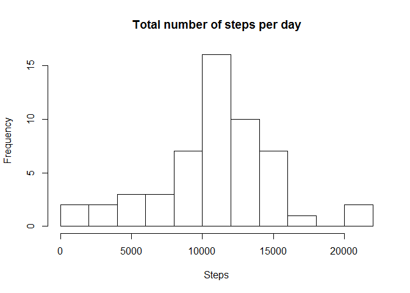
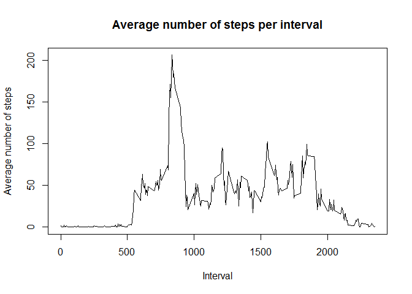
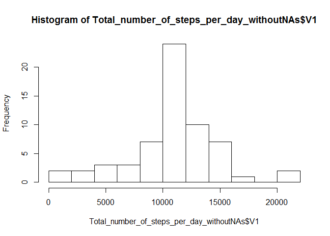
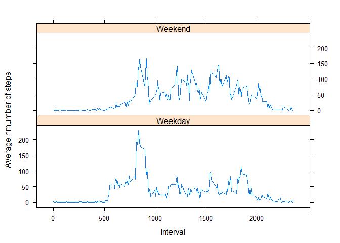

# Reproducible Research: Peer Assessment 1


## Loading and preprocessing the data

```r
unzip("activity.zip",exdir = "data")
data <- read.csv('data/activity.csv')

library(data.table)
data <- as.data.table(data)
```

## What is mean total number of steps taken per day?


```r
Total_number_of_steps_per_day <- data[,sum(steps),by=date]
```
Histogram of the total number of steps taken each day: 

```r
hist(Total_number_of_steps_per_day$V1, breaks = 10, main = 'Total number of steps per day', xlab = 'Steps')
```




```r
mean_steps <- mean(Total_number_of_steps_per_day$V1, na.rm = T)
mediansteps <- median(Total_number_of_steps_per_day$V1, na.rm = T)
```
Mean of the total number of steps taken per day is 10766 and the median is 10765.  

## What is the average daily activity pattern?
To see the average daily pattern, we created time series plot of the -minute interval and the average number of steps taken, averaged across all days:  

```r
average_per_int <- data[,mean(steps, na.rm=T),by=interval]
plot(average_per_int, type='l', ylab = 'Average number of steps', xlab = 'Interval', main = 'Average number of steps per interval')
```



Below is the 5-minute interval, that on average across all the days in the dataset, contains the maximum number of steps:

```r
average_per_int <- as.data.table(average_per_int)
average_per_int[V1==max(V1)]
```

```
##    interval       V1
## 1:      835 206.1698
```

## Imputing missing values
There are a number of days/intervals where there are missing values (coded as NA). The presence of missing days may introduce bias into some calculations or summaries of the data.  
The total number of missing values is 2304.

```r
sum(is.na(data$steps))
```

```
## [1] 2304
```
I decided to fill in the missing values using the mean for that 5-minute interval:

```r
NAs <- data[is.na(steps) == T]

NAs <- merge(as.data.frame(NAs), as.data.frame(average_per_int), by = 'interval', all.x = T)
NAs <- NAs[c(4,3,1)]
colnames(NAs) <- colnames(data)
```

Then new dataset with imputed missing values was created: 

```r
data_final <- rbind(as.data.frame(data[is.na(steps) == F]),NAs)
```

We again created histogram and calculated mean and median this time for data set with imputed missing values. 


```r
data_final <- as.data.table(data_final)
Total_number_of_steps_per_day_withoutNAs <- data_final[,sum(steps),by=date]

hist(Total_number_of_steps_per_day_withoutNAs$V1, breaks = 10)
```



```r
mean_steps_noNAs <- mean(Total_number_of_steps_per_day_withoutNAs$V1)
median_steps_noNAs <- median(Total_number_of_steps_per_day_withoutNAs$V1)
```

When replacing missing values with mean of the same 5-minute interval, the only impact on mean and meadian is, that they have the same value, in particular they are equal to 10766 and this number is also equal to the mean total number of steps in the first part, where we ignored the missing values. After imputing the data the mean remained the same and median shifted to the mean. 

## Are there differences in activity patterns between weekdays and weekends?

To find out if there are differences in activity patterns between weekdays and weekends, new factor variablewith two levels - "weekday" and "weekend" - was created. Tha variable indicates whether the given date is a weekday or weekend day. 


```r
data_final <- data_final[weekdays(as.Date(date)) %in% c('neděle','sobota'), type:= 'Weekend']
data_final <- data_final[weekdays(as.Date(date)) %in% c('pondělí','úterý', 'středa', 'čtvrtek', 'pátek'), type:= 'Weekday']
data_final$type <- as.factor(data_final$type)
```

To compare the average number of steps per 5-minute intervals over weekends and weekdays we plotted separately a time serie of the 5-minute interval (x-axis) and the average number of steps taken, averaged across all weekday days or weekend days (y-axis). 


```r
average_per_int_per_wd <- data_final[,mean(steps),by=c('type','interval')]

library(lattice)

xyplot(average_per_int_per_wd$V1  ~ average_per_int_per_wd$interval | average_per_int_per_wd$type , type = 'l', xlab = 'Interval', ylab = 'Average nmumber of steps', layout = c(1,2))
```



From the panel plot it seems that people are more active on weekdays in time intervals 500-1000 and for intervals 1000 and higher they are more active on weekends than at weekdays. 
